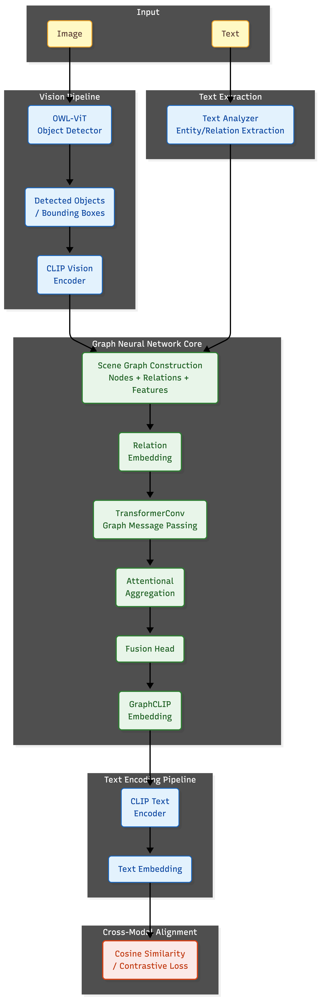

<div align="center">

[](https://pytorch.org/)
[](https://pyg.org/)
[](https://huggingface.co/docs/transformers/)
[](https://huggingface.co/)
[](https://openai.com/)
[](https://scikit-learn.org/)
[](https://homes.cs.washington.edu/~ranjay/visualgenome/api.html)

</div>

# GraphCLIP

GraphCLIP is a graph-enhanced vision-language model for semantic and relational image-text queries. The project includes both model training and inference pipelines and supports local checkpoints, portable artifacts, and Hugging Face pretrained models.

## Model Architecture

<div align="center">
  
</div>

GraphCLIP combines CLIP, OWL-ViT, PyTorch Geometric, and a Graph Neural Network to represent objects and their relationships as a scene graph.

## Dataset

The model was trained using the [Visual Genome](https://homes.cs.washington.edu/~ranjay/visualgenome/api.html) dataset, including its images, object annotations, relationships, and region descriptions.

## Installation

Clone the repository:

```bash
git clone https://github.com/beyzaprmk/GraphCLIP.git
cd GraphCLIP
```

Create a virtual environment:

```bash
python3 -m venv venv
source venv/bin/activate
```

Install dependencies:

```bash
pip3 install -r requirements.txt
```

## Model Download & Upload

Download a pretrained model:

```bash
python3 scripts/export_model.py --repo prmkkbb/graphclip-base
```

The model is downloaded into:

```text
artifacts/graphclip-base/
```

After logging into your account, upload your model to Hugging Face:

```bash
python3 scripts/upload_model.py --repo YOUR_USERNAME/graphclip-base
```

## Use of Pre-trained or Newly Trained Models

A pretrained model can be loaded directly from Hugging Face:

```python
from graphclip import GraphCLIPInference

engine = GraphCLIPInference.from_pretrained(
    "prmkkbb/graphclip-base"
)
```

It can also be loaded from a local artifact:

```python
engine = GraphCLIPInference.from_pretrained(
    "artifacts/graphclip-base"
)
```

A model produced by the training pipeline can also be loaded directly:

```python
engine = GraphCLIPInference.from_pretrained(
    "checkpoints/best_model.pt"
)
```

## Using GraphCLIP in Another Project

GraphCLIP can be installed from its cloned repository and used from a different project directory.

### 1. Clone GraphCLIP

```bash
git clone https://github.com/beyzaprmk/GraphCLIP.git
```

For example:

```text
workspace/
├── GraphCLIP/
└── MyProject/
```

### 2. Create or enter your project

```bash
mkdir MyProject
cd MyProject
```

### 3. Create a virtual environment

```bash
python3 -m venv venv
source venv/bin/activate
```

### 4. Install GraphCLIP dependencies

```bash
python -m pip3 install -r ../GraphCLIP/requirements.txt
```

### 5. Install GraphCLIP as a package

```bash
python -m pip3 install -e ../GraphCLIP
```

The `pyproject.toml` file is processed automatically by `pip`. There is no need to create or run `egg-info` manually.

### 6. Verify the installation

```bash
python3 -c "from graphclip import GraphCLIPInference; print('GraphCLIP import successful.')"
```

## Inference

```python
from graphclip import GraphCLIPInference

engine = GraphCLIPInference.from_pretrained(
    "artifacts/graphclip-base"
)

result = engine.predict(
    image="path/to/image.jpg",
    text="a flower next to a vase",
)

print("Similarity:", result["similarity"])
```

Inference does not require the original training dataset.

## Training

GraphCLIP can also be trained from scratch using the included training pipeline.

```bash
python3 main.py
```

The training process creates checkpoints under:

```text
checkpoints/
├── best_model.pt
└── epoch_*.pt
```

Training uses a CLIP-style bidirectional contrastive loss with AdamW and cosine annealing.

## Model Artifacts

A portable model artifact contains:

```text
artifacts/graphclip-base/
├── model.pt
├── config.json
├── metadata.json
└── final_vocab.json
```

## Relational Queries

GraphCLIP is designed for queries involving multiple objects and their relationships, such as:

```text
"flower next to vase"
"person holding a cup"
"car near a tree"
"person beside a bicycle"
```
